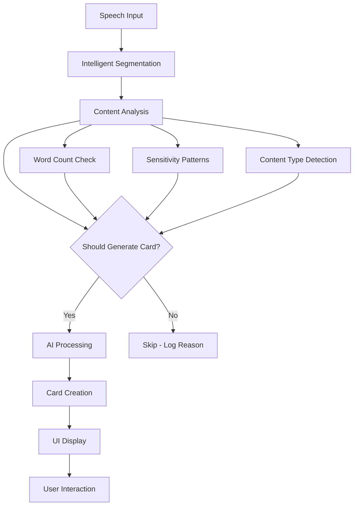

# Card Generation System Documentation

This document outlines how SenScript generates flashcards from speech transcription, including all settings, thresholds, and logic flows.

## Overview

The card generation system transforms spoken content into educational flashcards through multiple stages:

1. **Speech Recognition** → Text segments
2. **Intelligent Segmentation** → Meaningful chunks
3. **Content Analysis** → Decision to generate card
4. **AI Processing** → Card creation with personalization
5. **UI Display** → Card presentation and interaction

## Core Components

### 1. Settings Manager (`settings-manager.js`)

**Personalization Settings:**
```javascript
// Education settings (1-5 scale)
educationLevel: 3,     // 1=Beginner, 3=Balanced, 5=Expert
detailLevel: 3,        // 1=Brief, 3=Moderate, 5=Comprehensive  
exampleComplexity: 3,  // 1=Simple, 3=Real-world, 5=Academic

// Card sensitivity settings (NEW)
cardSensitivity: 3,    // 1=Conservative, 3=Normal, 5=Very Sensitive
captureQuestions: true, // Extract cards from questions asked
captureExamples: true,  // Extract cards from examples given
captureNumbers: true,   // Extract cards from statistics/numbers
minimumWordThreshold: 15 // Minimum words before considering for card
```

**Setting Mappings:**
- **Education Level**: `['Beginner', 'Basic', 'Intermediate', 'Advanced', 'Expert']`
- **Detail Level**: `['Brief', 'Concise', 'Moderate', 'Detailed', 'Comprehensive']`
- **Example Complexity**: `['Simple', 'Basic', 'Standard', 'Complex', 'Academic']`

### 2. Intelligent Segmentation (`intelligent-segmentation.js`)

**Purpose**: Replace rigid 5-second time chunks with content-aware segmentation.

**Key Parameters:**
```javascript
minSegmentLength: 15,    // Minimum words before considering segment
maxSegmentLength: 50,    // Maximum words per segment
silenceThreshold: 2000,  // 2 seconds of silence to finalize
punctuationWeight: 1.5   // Weight for sentence-ending punctuation
```

**Segmentation Logic:**
1. **Buffer Management**: Accumulates speech input until natural break
2. **Content Scoring**: Analyzes punctuation, clauses, word count
3. **Natural Boundaries**: Segments on sentences, not arbitrary time
4. **Silence Detection**: Uses speech pauses to finalize segments

**Scoring Algorithm:**
```javascript
calculateSegmentScore(text) {
    let score = 0;
    
    // Strong indicators: sentence-ending punctuation
    const sentences = text.match(/[.!?]/);
    if (sentences) score += sentences.length * 1.5;
    
    // Medium indicators: clause breaks
    const clauses = text.match(/[,;:]/);
    if (clauses) score += clauses.length * 0.5;
    
    // Word count sweet spot (20-30 words)
    const wordCount = getWordCount(text);
    if (wordCount >= 20 && wordCount <= 35) score += 0.5;
    
    // Penalize very short segments
    if (wordCount < 15) score *= 0.3;
    
    return score;
}
```

### 3. Card Generator (`card-generator.js`)

**Main Entry Point:**
```javascript
async generateFromText(text, isCheatMode = false, detection = null)
```

**Sensitivity Thresholds:**
```javascript
getWordThresholdBySensitivity(sensitivity) {
    const thresholds = {
        1: 25, // Conservative: Only substantial content
        2: 20, // Below Normal
        3: 15, // Normal: Balanced approach
        4: 10, // Above Normal: More sensitive
        5: 5   // Very Sensitive: Almost everything
    };
    return thresholds[sensitivity] || 15;
}
```

**Content Pattern Detection (High Sensitivity Mode):**
```javascript
shouldGenerateCard(text, settings) {
    // Basic word count check
    if (wordCount < minThreshold) return false;
    
    // High sensitivity checks (sensitivity >= 4)
    if (sensitivity >= 4) {
        // Questions: "What is...?", "How does...?", "Why...?"
        if (/\\b(what|how|why|when|where|who)\\b.*\\?/i.test(text)) 
            return true;
        
        // Numbers: "25%", "$1000", "3 million"
        if (/\\b\\d+[%$]?\\b|\\b\\d+\\s+(million|billion|thousand|percent)\\b/i.test(text))
            return true;
            
        // Examples: "for example", "such as", "like"
        if (/\\b(for example|such as|like|including|especially)\\b/i.test(text))
            return true;
            
        // Educational keywords
        if (/\\b(because|therefore|however|although|definition|concept)\\b/i.test(text))
            return true;
    }
    
    return true; // Meets word threshold
}
```

**API Payload Structure:**
```javascript
const queryPayload = {
    sessionId: this.sessionId,
    transcript: text,
    language: outputLanguage,
    textConfidence: detectedLanguage.confidence,
    languageFlag: outputFlag,
    cardMode: isCheatMode ? 'cheat' : 'flash',
    cardType: isCheatMode ? 'tip' : 'concept',
    
    // PERSONALIZATION DATA (NEW)
    personalization: {
        educationLevel: settings.educationLevel || 3,
        detailLevel: settings.detailLevel || 3,
        exampleComplexity: settings.exampleComplexity || 3,
        cardSensitivity: settings.cardSensitivity || 3,
        captureQuestions: settings.captureQuestions !== false,
        captureExamples: settings.captureExamples !== false,
        captureNumbers: settings.captureNumbers !== false
    }
};
```

## Card Generation Flow



## Sensitivity Levels Explained

### Level 1: Conservative (25+ words)
- Only generates cards from substantial, complete thoughts
- Ignores questions, examples, side comments
- Perfect for focused learning sessions
- **Example**: "Machine learning algorithms can be categorized into supervised, unsupervised, and reinforcement learning approaches, each serving different purposes in data analysis and prediction tasks."

### Level 3: Normal (15+ words)
- Balanced approach for general use
- Captures main concepts and explanations
- Filters out brief mentions
- **Example**: "The key difference between supervised and unsupervised learning is the presence of labeled training data."

### Level 5: Very Sensitive (5+ words)
- Captures almost everything interesting
- Extracts cards from questions: "What is machine learning?"
- Numbers and stats: "AI market worth $150 billion"
- Examples: "For example, neural networks..."
- Side comments: "That's actually quite fascinating"
- **Result**: 3-5x more cards generated

## Personalization Impact

### Education Level
- **Beginner (1)**: Simple explanations, basic terminology
- **Expert (5)**: Technical depth, advanced concepts, jargon acceptable

### Detail Level
- **Brief (1)**: Concise answers, key points only
- **Comprehensive (5)**: Detailed explanations, context, examples

### Example Complexity
- **Simple (1)**: Everyday analogies, common experience
- **Academic (5)**: Technical examples, research references

## Pattern Detection Examples

### Questions (High Sensitivity)
```javascript
// Matches these patterns:
"What is the definition of entropy?"
"How does machine learning work?"
"Why do we use neural networks?"
"When should you apply this technique?"
```

### Numbers/Statistics
```javascript
// Matches these patterns:
"The accuracy increased by 25%"
"Processing 1 million data points"
"$50 billion market size"
"3.7 million users"
```

### Examples and Explanations
```javascript
// Matches these patterns:
"For example, in image recognition..."
"Such as convolutional neural networks"
"Like supervised learning algorithms"
"Including deep learning methods"
```

### Educational Keywords
```javascript
// Matches these patterns:
"Because the algorithm learns..."
"Therefore, we can conclude..."
"However, there are limitations..."
"The definition of machine learning is..."
```

## Configuration Tweaking

### To Increase Card Sensitivity:
1. Set `cardSensitivity: 5` in settings
2. Enable all capture options: `captureQuestions: true`, etc.
3. Lower word thresholds in `getWordThresholdBySensitivity()`
4. Add more pattern detection in `shouldGenerateCard()`

### To Decrease Card Generation:
1. Set `cardSensitivity: 1` in settings  
2. Increase word thresholds
3. Add content filters to exclude certain patterns
4. Implement topic filtering (e.g., skip off-topic content)

### To Modify Content Detection:
Edit the regex patterns in `shouldGenerateCard()`:
```javascript
// Add new patterns
if (/\\b(remember that|important to note|key point)\\b/i.test(text)) {
    return { generate: true, reason: 'Important emphasis detected' };
}

// Exclude patterns
if (/\\b(um|uh|you know|like|basically)\\b/i.test(text)) {
    return { generate: false, reason: 'Filler words detected' };
}
```

## Performance Considerations

- **Card Generation Throttle**: 500ms debounce between generations
- **Minimum Segment Size**: 5 words absolute minimum
- **Maximum Processing**: ~50 words per segment for optimal AI processing
- **Silence Timer**: 2-second pause before finalizing segment

## Debugging and Monitoring

### Console Logs to Watch:
```javascript
// Segmentation decisions
"🧠 [IntelligentSegmentation] Natural segment: score 2.1, 23 words"

// Sensitivity checks  
"🎯 [CardGenerator] Sensitivity check: 18 words, threshold: 10, sensitivity: 5"

// Generation decisions
"🎯 [CardGenerator] Proceeding with generation: Question detected (high sensitivity)"

// API calls with personalization
"📤 [CardGenerator] Education: 4/5, Detail: 3/5, Sensitivity: 5/5"
```

### Common Issues:
- **Too Many Cards**: Lower sensitivity, increase word thresholds
- **Too Few Cards**: Increase sensitivity, enable capture options
- **Wrong Content**: Adjust pattern detection regex
- **Performance**: Check segment sizes and generation throttling

This system provides fine-grained control over card generation while maintaining educational value and user personalization.