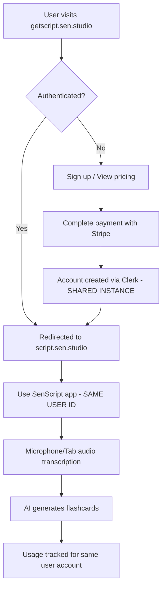

# SenScript - Dual Domain Architecture

## 🌐 **Domain Structure**

### **Marketing Website** 
- **URL**: https://getscript.sen.studio/
- **Purpose**: Landing page, user acquisition, payment processing
- **Status**: ✅ **Live & Working**

### **Web Application**
- **URL**: https://script.sen.studio/ 
- **Purpose**: Core SenScript transcription and card generation app
- **Status**: ✅ **Live & Working**

## 📁 **Codebase Structure**

```
/Users/densen/sen_dev/SenScript/
├── website/                    # Marketing Website (Next.js)
│   ├── src/app/               # App Router pages
│   ├── src/components/        # React components  
│   ├── src/lib/db/           # Database & Stripe integration
│   ├── package.json          # Next.js 15.5.0
│   └── vercel.json           # Deployment config
│
├── web-app/                   # Core Application (Vanilla JS)
│   ├── index.html            # Main app interface
│   ├── app.js                # Core SenScript logic
│   ├── server.js             # Express server
│   ├── auth.js               # Clerk authentication
│   ├── card-engine.js        # AI card generation
│   └── package.json          # Express + dependencies
│
└── monorepo/                  # Documentation
    ├── 07-Perfect-Audio-Flow.md
    └── 08-Architecture-Overview.md
```

## 🎯 **User Journey**

### **🔄 Seamless Cross-Domain Experience**


### **🎭 User Experience Flow**
1. **Discovery**: User finds SenScript via getscript.sen.studio
2. **Sign-up**: Creates account with Clerk (marketing site)
3. **Payment**: Subscribes via Stripe integration
4. **Seamless transition**: Clicks "Use App" → script.sen.studio
5. **Auto-authenticated**: Already logged in via shared Clerk session
6. **Start using**: Immediate access to transcription features

## 🛠 **Technical Stack**

### **Marketing Website (getscript.sen.studio)**
```typescript
Framework: Next.js 15.5.0 (App Router)
UI: React + Tailwind CSS
Authentication: Clerk
Database: Supabase 
Payments: Stripe
Deployment: Vercel
```

### **Web Application (script.sen.studio)**  
```javascript
Frontend: Vanilla JavaScript (ES6+)
Backend: Express.js + Node.js
Audio: Web Speech API + getDisplayMedia
AI: OpenAI + Anthropic + DeepSeek APIs
Authentication: Clerk (same as website)
Development: http://localhost:3001
```

## 🔄 **Development Workflow**

### **Marketing Website Changes**
```bash
cd /Users/densen/sen_dev/SenScript/website
npm run dev          # Local development  
npm run build        # Test build
vercel --prod        # Deploy to production
```

### **Web App Changes**
```bash  
cd /Users/densen/sen_dev/SenScript/web-app
npm start           # Local development (port 3001)
# No build step needed - vanilla JS served directly
```

## 🗄 **Data Flow**

### **User Management**
1. **Sign up** → Marketing website (getscript.sen.studio)
2. **Authentication** → Shared Clerk instance
3. **Subscription** → Stripe webhook → Supabase database
4. **App usage** → Web app (script.sen.studio)

### **Card Generation**
1. **Audio input** → Web Speech API (web-app)
2. **Transcription** → Real-time text processing
3. **AI processing** → OpenAI/Anthropic/DeepSeek APIs
4. **Card creation** → Instant flashcard generation
5. **Usage tracking** → Database via Express server

## 🔐 **Authentication & Authorization**

### **🔑 CRITICAL: Shared Clerk Users**
Both applications use the **SAME Clerk instance** with **SHARED USER DATABASE**:

- **✅ Single sign-on**: Users authenticate once, access both domains
- **✅ Unified user identity**: Same user ID across marketing site and web app
- **✅ Seamless experience**: Sign up on getscript.sen.studio → immediately use script.sen.studio
- **✅ Shared subscriptions**: Payment on marketing site → usage tracking in web app

### **Technical Implementation**
- **Clerk Publishable Key**: `pk_test_aHVtb3JvdXMtcGlyYW5oYS0zNy5jbGVyay5hY2NvdW50cy5kZXYk`
- **JWT tokens** for API authentication
- **Stripe customer IDs** linked to Clerk users
- **Supabase RLS** for data security
- **Cross-domain session sharing** enabled

## 🚀 **Deployment Status**

| Component | URL | Status | Last Updated |
|-----------|-----|--------|--------------|
| Marketing Site | https://getscript.sen.studio | ✅ Live | 2025-08-25 |
| Web Application | https://script.sen.studio | ✅ Live | Active Development |
| Database | Supabase | ✅ Connected | Real-time |
| Payments | Stripe | ✅ Processing | Live webhooks |

## 📊 **Key Metrics**

- **Card generation speed**: <3 seconds (primary KPI)
- **Audio sources**: Microphone + Tab audio capture  
- **Language support**: 13 languages
- **Platform compatibility**: Universal web conferencing
- **User experience**: Frictionless audio switching

## 🎛 **Current Development Focus**

1. **Perfect audio flow** - Seamless mic/device switching
2. **Tab audio transcription** - System audio capture working
3. **Performance optimization** - Speed is #1 priority
4. **User onboarding** - Smooth sign-up to usage flow

---

*This architecture enables rapid development of the core app while maintaining a professional marketing presence and robust payment processing.*